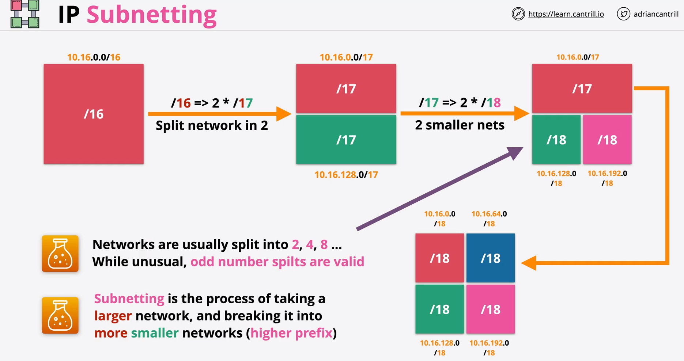

nat - network address translation
from private address to public address.

 In aws the **Internet Gateway** do the network address translation.

 NAT can be static or dynamic. In dynamic nat some private addresses can be translated to the same private IP address by default gateway, as long as this public address is not overlapping with other devices.

 ------------------

 pat - port address translation.
 PAT allows to use one public IP provided by the NATGateway to be shared accross lot of private devices in one network. They can use a one public address of a NATGateway but with different ports.
 Private addresses have even different ports, and the source ports are changed by the default gateway.
 For other way around, reverse movement of packets is allowed by **NAT Table.

 -------------

Higher prefix (/number) = smaller network. 

---------------
ssl and tls

1. Cipher Suite - After enabling connection, client side sends some data, and the server has response with a **certificate**. Part of a certificate is a public key of a server. Also, **Certificate Authority** is signing the certificate for future certification.
2. Authentication - Client side makes sure that certificate is valid. Then verifise server private key. 
3. Key Exchange - Right now is symmetric encription. Client side generates premaster key with servers public key inside. The server decrypts this with his own private key. **Premaster** keys on both sides makes **MASTER SECRETS** for encrypting and decrypting data on session.
