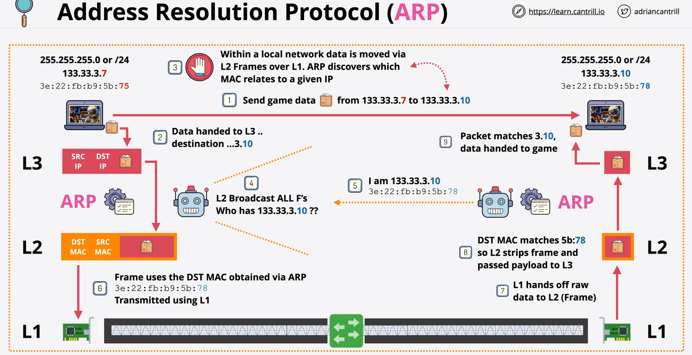
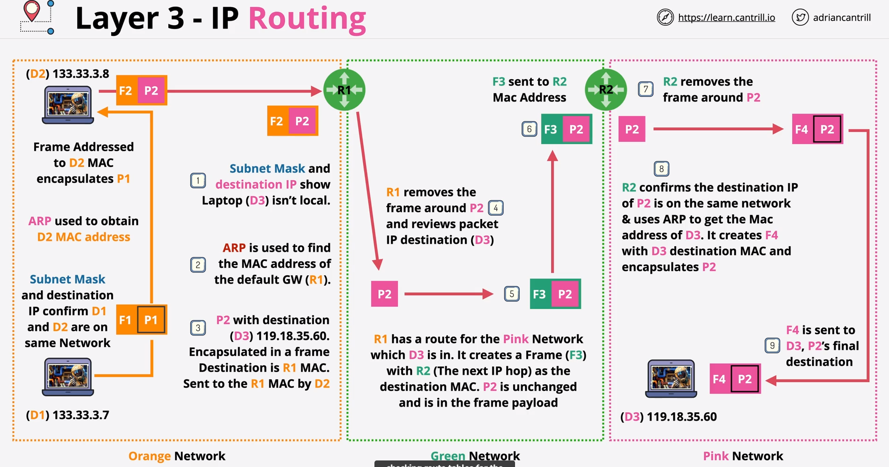

Device from specific layer **will understand this layer and all before layers**

1 layer - physical: 
- transmission and reception of raw bit streams
- shared medium

No device addressing, no collision detection on this layer!

-------------
Requires first layer working correctly.\

2 layer - data link:
- transmission of frames 
- Provides controlled access to Layer 1 by no collisions mechanism.
- Media access control
- Identifiable devices

L2 devices has Mac addresses are made of OUI and NIC.
Frame are made of:
- Preamble
- Destination Mac address or broadcasting (ALL F's) MAC HEADER PART
- Source MAC address MAC HEADER PART
- ET (what layer 3 protocol puts data to frame) MAC HEADER PART
- Payload **Needs to be extracted (decapsulated) from the frame**
- Frame Check Sequence (FCS)

If carrier is detected than it will be transmission. If transmission is done at the same time, then it will be **backoff** - moment when two parts will no transmit anything. One side must send something, and a second side must see a carry on.

Ethernet is a L2 protocol for local networks.

----------

IP (**Internet Protocol**) is a Layer 3 protocol.

IP is used on layer 3 for **packets**:
- Protocol (what protocol from layer 4 is used)
- Source IP Address
- Destination IP Address
- Data (main part)
- Time to Live (TTL) - how long the packet should live

IP address can be established by hand or by DHCP (Dynamic Host Configuration Protocol).

Subnet mask is a number in binary, that determines what part of IP address is Network, and what part is a host.
Where in the subnet mask is a one, that means it is a number for a network. (Bits for network)

IPSs have Route tables, where all traffic is simplified to routing. 
Rows there are made of :
- Destination
- Next Hop/Target (Place where packet will be closer to the destination)
**The larger number after slash (bigger subnet mask)** - MORE SPECIFIC ROUTE.

Default route has destination IP address made of zeros with zero after slash (0.0.0.0/0). NOT SPECIFIC. /0 menas that 0 bits are for network, so it **can be any ip address**.

For packets to know what frame should be sent right now to specific device where IP route hits destination, IP needs MAC ADDRESS. This is a time whrere **ARP - Address Resolution Protocol** comes in. Between Layer 3 and Layer 2.

Downsizes:
- no channels of communication
- delivering out of order can happen.